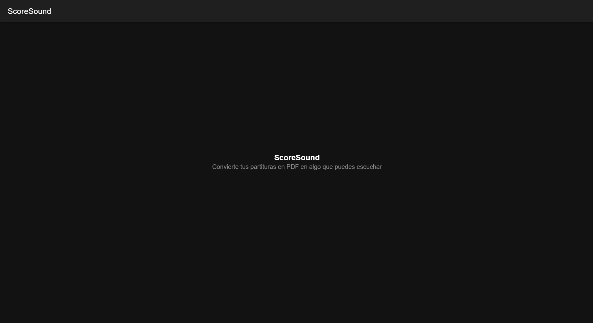

# Semana 6 — Monta tu entorno y crea tu primer proyecto

**Programación Móvil · Unidad 2 · Corte 2 · 2026-B**
Juan José Horta Vanegas — Ingeniería de Sistemas · CORHUILA

Montaje del entorno de desarrollo híbrido y creación del primer proyecto en
Ionic React, con la pantalla inicial modificada.

---

## 1. Entorno instalado

| Herramienta | Para qué sirve | Versión |
|---|---|---|
| Node.js | Ejecuta JavaScript fuera del navegador; trae npm incluido | v24.15.0 |
| npm | Gestor de paquetes: descarga las dependencias del proyecto | 11.14.1 |
| Ionic CLI | Crea, ejecuta y compila proyectos Ionic | 7.2.1 |
| Visual Studio Code | Editor donde se escribe el código | — |

Instalé la versión **LTS** de Node y no la Current, porque la LTS es la estable
y con soporte a largo plazo. Usar la Current es uno de los errores comunes que
señala la sesión, ya que varias librerías todavía no la soportan.

---

## 2. Pasos que seguí

### 2.1 Instalar Node.js

Descargué el instalador **LTS** desde el sitio oficial y lo ejecuté con las
opciones por defecto. Después cerré la terminal y la abrí de nuevo, porque
Windows solo reconoce el programa recién instalado en terminales abiertas
después de la instalación.

Verificación:

```bash
node --version   # v24.15.0
npm --version    # 11.14.1
```

### 2.2 Instalar el CLI de Ionic

```bash
npm install -g @ionic/cli
```

La bandera `-g` instala la herramienta de forma **global**, es decir en todo el
computador y no dentro de un proyecto. Tiene sentido, porque el CLI se usa
justamente para crear proyectos que todavía no existen.

Durante la instalación aparecieron avisos de `deprecated`. No son errores:
indican que algunas librerías internas del CLI son antiguas, pero la
instalación se completó correctamente.

Verificación:

```bash
ionic --version  # 7.2.1
```


### 2.3 Crear el proyecto

```bash
cd %USERPROFILE%\Desktop
ionic start miApp blank --type=react
```

| Parte del comando | Qué significa |
|---|---|
| `miApp` | Nombre del proyecto y de la carpeta que se crea |
| `blank` | Plantilla vacía, con una sola pantalla |
| `--type=react` | Framework a usar (Ionic también soporta Angular y Vue) |

El CLI generó 29 archivos y descargó las dependencias del proyecto.

### 2.4 Ejecutar el proyecto

```bash
cd miApp
ionic serve
```

El comando levanta la aplicación en `http://localhost:8100` con **recarga
automática**: al guardar un archivo, el navegador se actualiza solo sin
necesidad de recargar a mano. Esto se comprobó al cambiar el título, que se
reflejó de inmediato en pantalla.

---

## 3. Modificación de la pantalla inicial

### 3.1 El título

El título vive en `src/pages/Home.tsx` y aparece **dos veces**: una en el
encabezado normal y otra en el encabezado grande que se muestra al deslizar
hacia abajo. Cambié las dos, porque si solo se cambia una, al desplazar la
pantalla reaparece el título original.

**Antes:**

```tsx
<IonTitle>Blank</IonTitle>
...
<IonTitle size="large">Blank</IonTitle>
```

**Después:**

```tsx
<IonTitle>ScoreSound</IonTitle>
...
<IonTitle size="large">ScoreSound</IonTitle>
```

### 3.2 El contenido central

También cambié el texto del centro, que estaba en
`src/components/ExploreContainer.tsx` y traía el mensaje de fábrica de Ionic,
para que la pantalla corresponda al proyecto que vengo trabajando en el curso.

**Antes:**

```tsx
<strong>Ready to create an app?</strong>
<p>Start with Ionic <a ...>UI Components</a></p>
```

**Después:**

```tsx
<strong>ScoreSound</strong>
<p>Convierte tus partituras en PDF en algo que puedes escuchar</p>
```

### 3.3 Resultado



---

## 4. Estructura del proyecto generado

```
miApp/
├── src/
│   ├── pages/                    → pantallas completas
│   │   ├── Home.tsx              → pantalla inicial (aquí cambié el título)
│   │   └── Home.css
│   ├── components/               → piezas reutilizables entre pantallas
│   │   ├── ExploreContainer.tsx  → contenido central (también modificado)
│   │   └── ExploreContainer.css
│   ├── theme/variables.css       → colores y variables de estilo
│   ├── App.tsx                   → raíz de la aplicación y rutas
│   └── main.tsx                  → punto de entrada
├── public/                       → archivos estáticos (íconos, manifest)
├── cypress/                      → pruebas de extremo a extremo
├── index.html                    → documento base de la aplicación
├── package.json                  → dependencias y scripts
├── ionic.config.json             → configuración del proyecto Ionic
├── capacitor.config.ts           → configuración para compilar a Android/iOS
├── vite.config.ts                → configuración de Vite
└── tsconfig.json                 → configuración de TypeScript
```

La diferencia entre `pages/` y `components/` es la que organiza todo el
proyecto: una **página** es un destino al que se navega, mientras que un
**componente** es una pieza que se usa dentro de una o varias páginas.

Este proyecto usa **Vite** como herramienta de construcción, que es lo que
permite la recarga automática casi instantánea al guardar un archivo. También
incluye **Capacitor**, que es la pieza que más adelante permitirá empaquetar la
aplicación web como una app nativa de Android o iOS.

---

## 5. Notas

- La carpeta `node_modules` no está incluida en el repositorio. Contiene las
  dependencias descargadas, pesa cientos de megabytes y se regenera con
  `npm install`. Lo que sí se sube es `package.json`, que es la lista de lo que
  hay que descargar. Por eso, al clonar este proyecto, el primer paso siempre
  es ejecutar `npm install`.
- El proyecto se probó en el navegador con `ionic serve`. Como recomienda la
  sesión, antes de una entrega final conviene probarlo también en un
  dispositivo real, porque el rendimiento y los gestos se sienten distinto a
  como se ven en el navegador o en un emulador.

---

## 6. Cómo ejecutar este proyecto

```bash
cd miApp
npm install
ionic serve
```
