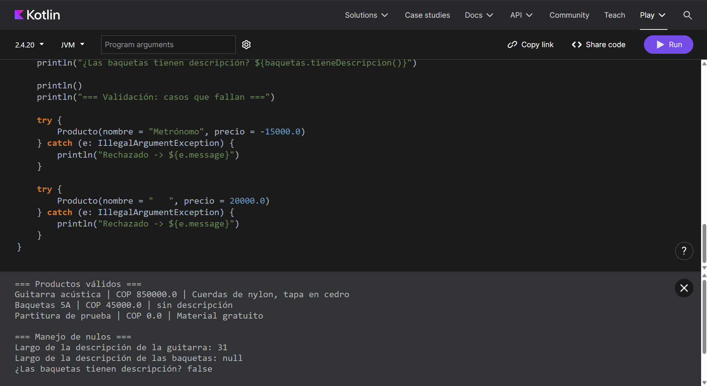

# Semana 7 — Kotlin básico y un componente Ionic

**Programación Móvil · Unidad 2 · Corte 2 · 2026-B**
Juan José Horta Vanegas — Ingeniería de Sistemas · CORHUILA

---

## Contenido

```
07-week/
├── kotlin/
│   └── Producto.kt        → clase con validación y manejo de nulos
├── ionic/
│   ├── Saludo.tsx         → componente con nombre y botón
│   ├── Saludo.css         → estilos del componente
│   └── Home.tsx           → pantalla modificada para mostrar el componente
├── captura-kotlin.png     → salida del programa Kotlin
├── captura-ionic.png      → componente funcionando en la app
└── README.md
```

---

## 1. Clase Producto en Kotlin

### Qué hace

La clase recibe un nombre, un precio y una descripción opcional. Antes de crear
el objeto verifica que el nombre no esté vacío y que el precio no sea negativo.
Si alguna condición falla, el objeto **nunca llega a existir**.

### El uso de `val`

Los tres parámetros son `val`, es decir inmutables: una vez creado el producto,
su nombre, su precio y su descripción no cambian. Se usó `val` y no `var`
porque ninguno de los tres necesita cambiar después de la creación, y la sesión
señala como error común usar `var` para todo.

### La validación

```kotlin
init {
    require(nombre.isNotBlank()) {
        "El nombre del producto no puede estar vacío"
    }
    require(precio >= 0) {
        "El precio no puede ser negativo (se recibió: $precio)"
    }
}
```

El bloque `init` se ejecuta al construir el objeto. La función `require`
comprueba la condición y, si no se cumple, lanza una excepción con el mensaje
indicado.

La ventaja de validar aquí y no después es que **no puede existir un Producto
inválido**: la validación ocurre antes de que el objeto termine de crearse.

### El manejo de nulos

La descripción se declaró como `String?`, con signo de interrogación, porque un
producto puede tener descripción o no tenerla. Es el único de los tres
atributos donde la ausencia de valor tiene sentido real dentro del problema.

Eso obliga a tratar el caso nulo en los dos métodos que la usan:

```kotlin
// Operador Elvis: si descripcion es null, usa el texto de reemplazo
val detalle = descripcion ?: "sin descripción"

// Llamada segura: si descripcion es null, devuelve null en lugar de fallar
fun largoDescripcion(): Int? = descripcion?.length
```

Sin el `?.`, pedir la longitud de una descripción inexistente produciría un
`NullPointerException` en ejecución. Con él, el compilador obliga a contemplar
ese caso desde que se escribe el código.

### Ejemplos incluidos

El programa imprime tres productos válidos, uno de ellos **sin descripción**
para demostrar el manejo de nulos y otro con **precio 0**, que es válido porque
la regla es `precio >= 0` y no `precio > 0`.

Después intenta crear dos productos inválidos —uno con precio negativo y otro
con el nombre vacío— y captura la excepción para mostrar el mensaje de
validación sin que el programa se detenga.

### Salida obtenida

```
=== Productos válidos ===
Guitarra acústica | COP 850000.0 | Cuerdas de nylon, tapa en cedro
Baquetas 5A | COP 45000.0 | sin descripción
Partitura de prueba | COP 0.0 | Material gratuito

=== Manejo de nulos ===
Largo de la descripción de la guitarra: 31
Largo de la descripción de las baquetas: null
¿Las baquetas tienen descripción? false

=== Validación: casos que fallan ===
Rechazado -> El precio no puede ser negativo (se recibió: -15000.0)
Rechazado -> El nombre del producto no puede estar vacío
```



---

## 2. Componente Saludo en Ionic React

### Qué hace

Muestra un saludo con un nombre y un botón. Al tocar el botón, el saludo cambia
de forma cíclica entre cuatro variantes.

### El nombre llega desde afuera

```tsx
interface SaludoProps {
  nombre: string;
}

const Saludo: React.FC<SaludoProps> = ({ nombre }) => { ... }
```

En lugar de escribir el nombre dentro del componente, se recibe como
**prop** desde quien lo usa. Así el mismo componente sirve para cualquier
nombre, que es lo que hace que un componente valga la pena.

La `interface` es la parte de TypeScript: declara que la prop `nombre` debe ser
un texto. Si alguien intenta pasarle un número, el editor lo marca como error
antes de ejecutar.

### El botón cambia el estado

```tsx
const [indice, setIndice] = useState(0);

const cambiarSaludo = () => {
  setIndice((actual) => (actual + 1) % SALUDOS.length);
};
```

`useState` guarda un valor dentro del componente. Cuando ese valor cambia,
React vuelve a dibujar la pantalla solo, sin que haya que tocar el HTML a mano.

El operador `%` hace que el índice vuelva a cero al llegar al final de la
lista, para que el botón se pueda tocar indefinidamente.

### Cómo se conecta

Un componente que existe pero no se usa no aparece en pantalla. Por eso hubo
que importarlo y colocarlo dentro de `Home.tsx`:

```tsx
import Saludo from '../components/Saludo';
...
<Saludo nombre="Juan José" />
```

### Resultado


---

## 3. Dos diferencias entre Kotlin y TypeScript

### Diferencia 1 — Cómo tratan los valores nulos

**Kotlin obliga a declarar la nulabilidad; TypeScript, por defecto, no.**

En Kotlin, un tipo normal **no admite null**. Para permitirlo hay que escribirlo
explícitamente con `?`, y a partir de ahí el compilador exige tratar ese caso:

```kotlin
var texto: String = "hola"    // no admite null
var opcional: String? = null  // sí admite null
opcional?.length              // obligatorio el ?. para acceder
```

En TypeScript, escribir `string` no impide que llegue `null` o `undefined`, a
menos que se active la opción `strictNullChecks` en la configuración. Cuando
está activa el comportamiento se parece al de Kotlin; cuando no, el error
aparece en ejecución y no al escribir.

**Por qué importa:** en Kotlin la protección viene de fábrica y no se puede
apagar; en TypeScript es una configuración que el proyecto puede tener o no.
Esa es la razón de que se diga que Kotlin es *null-safe* por diseño.

### Diferencia 2 — Lenguaje compilado a bytecode frente a lenguaje que se traduce a JavaScript

**Kotlin se compila a bytecode de la máquina virtual de Java; TypeScript se
traduce a JavaScript y desaparece en ejecución.**

Kotlin produce un programa que corre sobre la JVM o sobre Android. Los tipos
siguen existiendo mientras el programa se ejecuta.

TypeScript no se ejecuta en ningún lado: antes de correr, se convierte en
JavaScript normal y **todos los tipos se borran**. Sirven solo mientras se
escribe el código.

```typescript
const nombre: string = "Ana";   // lo que escribes
const nombre = "Ana";           // lo que realmente se ejecuta
```

**Por qué importa:** en TypeScript los tipos son una ayuda para el
programador, no una garantía en ejecución. Si un dato llega mal desde un
servidor, TypeScript no lo detiene, porque en ese momento ya no queda ningún
tipo que revisar. En Kotlin, en cambio, el tipo sigue vigente mientras el
programa corre.

### Lo que sí comparten

Ambos tienen tipos, funciones e inmutabilidad, y usan palabras equivalentes:

| Concepto | Kotlin | TypeScript |
|---|---|---|
| Valor que no cambia | `val` | `const` |
| Valor que sí cambia | `var` | `let` |
| Tipo declarado | `val n: String` | `const n: string` |
| Insertar variable en texto | `"Hola, $n"` | `` `Hola, ${n}` `` |

---

## Cómo probar cada parte

**Kotlin:** pegar el contenido de `kotlin/Producto.kt` en
[play.kotlinlang.org](https://play.kotlinlang.org) y presionar Run.

**Ionic React:** copiar `Saludo.tsx` y `Saludo.css` a `src/components/` del
proyecto, reemplazar `src/pages/Home.tsx` por el de esta carpeta, y ejecutar
`ionic serve`.
