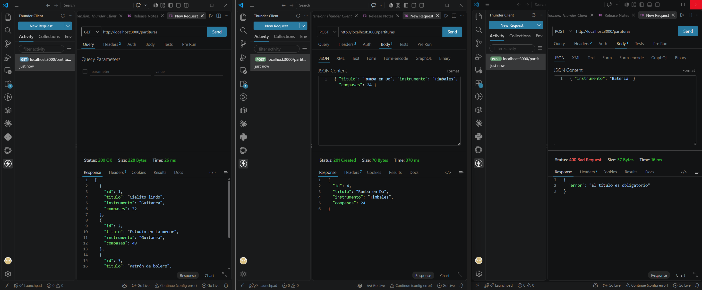
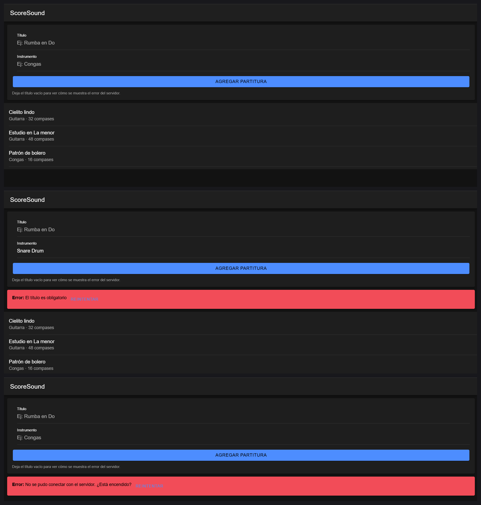

# Semana 8 — API REST con Express y consumo desde la app

**Programación Móvil · Unidad 2 · Corte 2 · 2026-B**
Juan José Horta Vanegas — Ingeniería de Sistemas · CORHUILA

API REST de partituras para la app **ScoreSound**, con endpoints GET y POST, y
consumo desde la app con manejo de errores.

---

## Contenido

```
08-week/
├── api/
│   ├── server.js          → la API con Express
│   ├── package.json       → dependencias
│   └── .gitignore         → excluye node_modules
├── app/
│   ├── services/api.ts             → las dos funciones fetch
│   ├── components/ListaPartituras.tsx   → pantalla que consume la API
│   ├── components/ListaPartituras.css
│   └── pages/Home.tsx              → muestra el componente
└── README.md
```

---

## 1. La API

### Cómo ejecutarla

```bash
cd api
npm install
npm start
```

Queda escuchando en `http://localhost:3000`.

### Endpoints

| Método | Ruta | Qué hace | Respuesta |
|---|---|---|---|
| GET | `/partituras` | Lista todas | 200 con el arreglo |
| GET | `/partituras/:id` | Devuelve una | 200, o 404 si no existe |
| POST | `/partituras` | Crea una nueva | 201 con la creada, o 400 si es inválida |

### Decisiones tomadas

**`app.use(cors())`** — sin esto el navegador bloquea la petición, porque la app
corre en el puerto 8100 y la API en el 3000, y para el navegador son sitios
distintos. El error aparece en consola aunque la API funcione bien.

**`app.use(express.json())`** — convierte el cuerpo de la petición en un objeto.
Sin esta línea `req.body` llega vacío en el POST.

**Validación en el servidor** — el POST rechaza las partituras sin título y los
compases negativos, respondiendo con código 400 y un mensaje. Esto es necesario
por dos razones: la lógica del negocio debe vivir en el servidor y no en la app,
que el usuario puede modificar; y sin errores reales no habría nada que probar
en el manejo de errores del cliente.

**`siguienteId` en lugar de `partituras.length + 1`** — si se borra un elemento,
la longitud vuelve a bajar y dos partituras terminarían con el mismo id.

**Los datos viven en memoria** — al detener el servidor se pierden. Para esta
práctica es suficiente; en el proyecto real irían a una base de datos.

---

## 2. Pruebas de los endpoints

Probado con **Thunder Client** (extensión de VS Code).

### Caso 1 — Listar partituras

```
GET http://localhost:3000/partituras
```

Respuesta `200 OK`:

```json
[
  { "id": 1, "titulo": "Cielito lindo", "instrumento": "Guitarra", "compases": 32 },
  { "id": 2, "titulo": "Estudio en La menor", "instrumento": "Guitarra", "compases": 48 },
  { "id": 3, "titulo": "Patrón de bolero", "instrumento": "Congas", "compases": 16 }
]
```

### Caso 2 — Consultar una que existe

```
GET http://localhost:3000/partituras/2
```

Respuesta `200 OK`:

```json
{ "id": 2, "titulo": "Estudio en La menor", "instrumento": "Guitarra", "compases": 48 }
```

### Caso 3 — Consultar una que no existe

```
GET http://localhost:3000/partituras/99
```

Respuesta `404 Not Found`:

```json
{ "error": "No existe una partitura con ese id" }
```

### Caso 4 — Crear una partitura válida

```
POST http://localhost:3000/partituras
Content-Type: application/json

{ "titulo": "Rumba en Do", "instrumento": "Timbales", "compases": 24 }
```

Respuesta `201 Created`:

```json
{ "id": 4, "titulo": "Rumba en Do", "instrumento": "Timbales", "compases": 24 }
```

El id no lo envía el cliente: lo asigna el servidor.

### Caso 5 — Crear sin título

```
POST http://localhost:3000/partituras
Content-Type: application/json

{ "instrumento": "Batería" }
```

Respuesta `400 Bad Request`:

```json
{ "error": "El título es obligatorio" }
```

### Caso 6 — Crear con compases negativos

```
POST http://localhost:3000/partituras
Content-Type: application/json

{ "titulo": "Prueba", "compases": -5 }
```

Respuesta `400 Bad Request`:

```json
{ "error": "Los compases deben ser un número mayor que cero" }
```

### Caso 7 — Ruta que no existe

```
GET http://localhost:3000/otra-cosa
```

Respuesta `404 Not Found`:

```json
{ "error": "Ruta no encontrada" }
```

### Resumen

| # | Prueba | Esperado | Obtenido |
|---|---|---|---|
| 1 | Listar | 200 + arreglo | ✅ |
| 2 | Consultar existente | 200 + objeto | ✅ |
| 3 | Consultar inexistente | 404 | ✅ |
| 4 | Crear válida | 201 + objeto | ✅ |
| 5 | Crear sin título | 400 | ✅ |
| 6 | Compases negativos | 400 | ✅ |
| 7 | Ruta inexistente | 404 | ✅ |



---

## 3. Consumo desde la app

### Las dos funciones

Están en `app/services/api.ts`. Las pantallas nunca llaman a `fetch`
directamente: solo esta capa conoce la dirección del servidor, así que el día
que la API se despliegue basta cambiar una constante.

| Función | Hace |
|---|---|
| `listarPartituras()` | `GET /partituras`, devuelve el arreglo |
| `crearPartitura(datos)` | `POST /partituras`, devuelve la partitura creada |

### El manejo de errores

`fetch` tiene un comportamiento que sorprende: **no lanza error cuando el
servidor responde 400, 404 o 500.** Para `fetch`, recibir una respuesta ya es un
éxito; solo falla si no hubo conexión.

Por eso hay que revisar `resp.ok` a mano:

```ts
async function leerRespuesta(resp: Response) {
  const datos = await resp.json().catch(() => null);

  if (!resp.ok) {
    const mensaje = datos?.error ?? `El servidor respondió ${resp.status}`;
    throw new Error(mensaje);
  }

  return datos;
}
```

Se cubren tres situaciones distintas:

| Situación | Cómo se detecta | Qué ve el usuario |
|---|---|---|
| El servidor rechaza la petición (400 / 404) | `resp.ok` es falso | El mensaje que envió el servidor |
| El servidor está apagado | `fetch` lanza `TypeError` | "No se pudo conectar con el servidor" |
| La respuesta no es JSON válido | `.catch(() => null)` en `resp.json()` | El código HTTP en el mensaje |

### La pantalla

`ListaPartituras.tsx` consume esas funciones y cubre los cuatro estados de una
pantalla que depende de la red: **cargando**, **con datos**, **vacía** y **con
error**, este último con botón de reintentar.

### Los tres casos probados en la app

| # | Situación | Cómo se provocó | Qué mostró la app |
|---|---|---|---|
| 1 | Datos cargados | Abrir la app con la API encendida | Las tres partituras traídas del servidor |
| 2 | El servidor rechaza | Dejar el título vacío y presionar *Agregar partitura* | "El título es obligatorio" en rojo, y la lista sigue visible |
| 3 | El servidor apagado | Detener la API con `Ctrl + C` y recargar | "No se pudo conectar con el servidor", con botón de reintentar |

El caso 2 es el que demuestra que el mensaje **no lo inventa la app**: viene del
servidor junto con el código 400, y la aplicación lo muestra sin romperse.

El caso 3 es distinto: ahí no hubo respuesta, así que `fetch` lanzó un
`TypeError` que se traduce a un mensaje entendible para el usuario.



---

## 4. Cómo ejecutar todo

Hacen falta **dos terminales** al mismo tiempo.

**Terminal 1 — la API**

```bash
cd 08-week/api
npm install
npm start
```

**Terminal 2 — la app**

```bash
cd miApp
ionic serve
```

Los archivos de `app/` van copiados dentro de `miApp/src/` respetando la misma
estructura de carpetas.

> **Nota sobre dispositivos reales:** `localhost` significa "este mismo
> computador". Al probar en un teléfono físico hay que reemplazar la constante
> `URL_API` por la IP del computador en la red local (por ejemplo
> `http://192.168.1.15:3000`), con ambos equipos en el mismo wifi.
