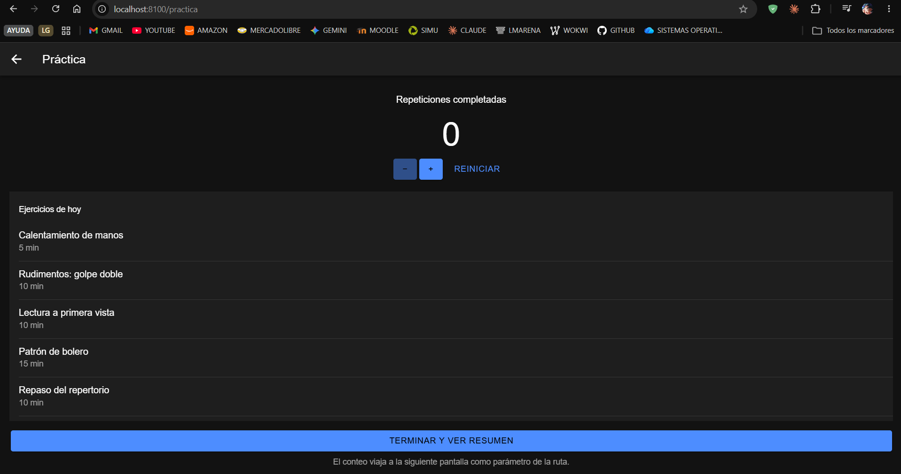
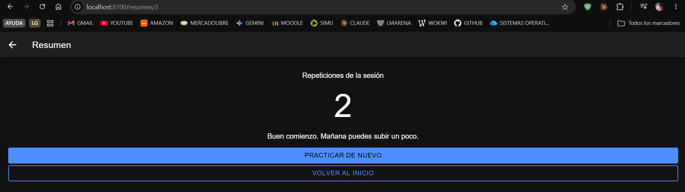
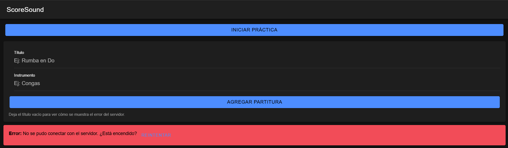

# Semana 9 — Lista, contador con useState y navegación entre páginas

**Programación Móvil · Unidad 2 · Corte 2 · 2026-B**
Juan José Horta Vanegas — Ingeniería de Sistemas · CORHUILA

Dos pantallas nuevas en el proyecto **ScoreSound**: una con una lista de
ejercicios y un contador de repeticiones, y otra que recibe ese conteo y lo
muestra.

---

## Contenido

```
09-week/
├── app/
│   ├── App.tsx                 → rutas de las dos pantallas nuevas
│   └── pages/
│       ├── Home.tsx            → botón que lleva a la práctica
│       ├── Practica.tsx        → IonList + contador con useState
│       └── Resumen.tsx         → lee el conteo con useParams
├── captura-1-inicio.png
├── captura-2-practica.png
├── captura-3-resumen.png
└── README.md
```

Los archivos van dentro de `miApp/src/`, respetando esa estructura.

---

## 1. La pantalla con lista y contador

`Practica.tsx` resuelve las dos primeras partes de la actividad.

### El contador

```tsx
const [repeticiones, setRepeticiones] = useState(0);

const sumar = () => setRepeticiones((actual) => actual + 1);
```

`useState` devuelve dos cosas: el valor actual y la función que lo cambia. Lo
importante es que esa función no solo guarda el número, también le avisa a React
que redibuje la pantalla. Sin eso el valor cambiaría pero nada se vería.

A `setRepeticiones` se le pasa **una función** en vez del valor directo. La
alternativa, `setRepeticiones(repeticiones + 1)`, funciona para un contador
simple, pero si se disparan dos actualizaciones muy seguidas las dos leen el
mismo valor viejo y una se pierde. Pasando una función, React entrega siempre el
conteo más reciente.

El botón de restar usa `Math.max(0, actual - 1)` para que el contador no baje de
cero, y queda deshabilitado cuando ya está en cero.

### La lista

```tsx
{EJERCICIOS.map((ejercicio) => (
  <IonItem key={ejercicio.id}>
    ...
  </IonItem>
))}
```

Los ejercicios son una constante fuera del componente, no estado: nunca cambian,
y meterlos en `useState` haría creer que sí.

La `key` es el **id del dato y no la posición**. React la usa para saber qué
elemento es cuál al redibujar; si se usa la posición y la lista se reordena, las
keys terminan señalando a otro elemento. Olvidar la key es uno de los errores
comunes que señala la sesión.



---

## 2. La navegación

### Las rutas

En `App.tsx` se registraron las dos pantallas nuevas:

```tsx
<Route path="/practica" element={<Practica />} />
<Route path="/resumen/:repeticiones" element={<Resumen />} />
```

Los dos puntos en `/resumen/:repeticiones` marcan un **parámetro**: no es una
dirección fija, `/resumen/2` y `/resumen/15` entran las dos por ahí.

La ruta que redirige a `/home` se dejó de última a propósito. Si va primero,
atrapa todas las direcciones y ninguna otra pantalla se muestra.

### Cómo se navega

```tsx
<IonButton routerLink={`/resumen/${repeticiones}`}>
  Terminar y ver resumen
</IonButton>
```

`routerLink` es la forma declarativa: el usuario toca y se mueve. La otra forma
es la programática, con `useNavigate`, que se usa cuando la navegación la decide
el código y no el dedo del usuario, por ejemplo después de un inicio de sesión
correcto.

Aquí el conteo del contador se inserta en la dirección, así que **el dato viaja
dentro de la URL**.

### Cómo se recibe

```tsx
const { repeticiones } = useParams<{ repeticiones: string }>();
const total = Number(repeticiones) || 0;
```

`useParams` entrega los parámetros de la ruta **siempre como texto**: `/resumen/2`
devuelve `"2"`, no `2`. Por eso hay que convertirlo antes de usarlo.



En la barra de direcciones se ve `localhost:8100/resumen/2`, y la pantalla
muestra ese mismo 2. Esa correspondencia es la evidencia de que el valor pasó de
una pantalla a la otra.

---

## 3. Cómo se llega a las pantallas nuevas

Una ruta que existe pero a la que nadie navega no se ve nunca. Por eso se agregó
un botón en `Home.tsx`:

```tsx
<IonButton expand="block" routerLink="/practica">
  Iniciar práctica
</IonButton>
```



El resto de `Home.tsx` se conservó: el formulario y la lista de partituras que
consumen la API siguen funcionando igual.

> El mensaje de error que aparece en la primera captura es de la actividad
> anterior: la API de Express no estaba encendida en ese momento. Es el manejo de
> errores de la semana 8 trabajando, no un fallo de esta entrega.

---

## 4. Recorrido completo

| Paso | Qué pasa | Qué lo demuestra |
|---|---|---|
| 1 | En el inicio se toca *Iniciar práctica* | Navegación entre páginas |
| 2 | Se sube el contador con el botón `+` | `useState` y redibujado |
| 3 | Se ve la lista de cinco ejercicios | `IonList` con `key` |
| 4 | Se toca *Terminar y ver resumen* | Navegación con `routerLink` |
| 5 | La URL muestra `/resumen/2` | El parámetro viajó en la ruta |
| 6 | La pantalla muestra el mismo número | `useParams` leyó el parámetro |

---

## Cómo ejecutarlo

```bash
cd miApp
npm install
ionic serve
```

Los archivos de `app/` se copian dentro de `miApp/src/`: `App.tsx` en la raíz de
`src`, y los tres de `pages/` en `src/pages/`.
